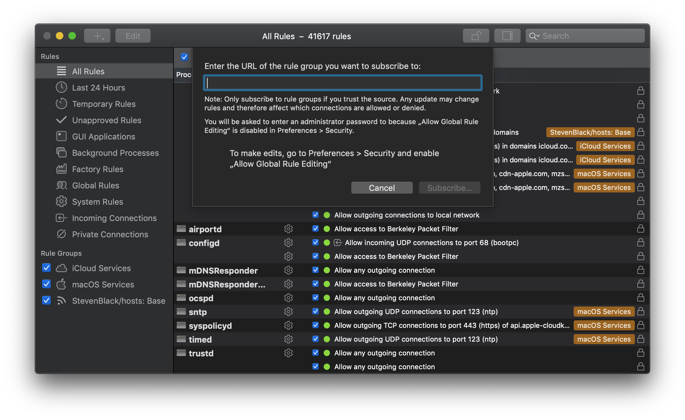

# Little Snitch Rule Groups

When using Little Snitch for the first time, every connection outside the built-in rule groups that come with the default install (such as iCloud and macOS Services) will trigger a prompt to allow or deny it. This can become overwhelming, especially on new installations.

Rule groups allows for rules to be shared by enabling subscriptions. This repository contains a number of rules for several popular macOS applications.

# Usage

To subscribe to one of the rules available, open Little Snitch Configuration.app and go to `File > New Rule Group Subscription (⇧⌘M)`. On GitHub, click on the desired rule and hit `Download`. This will redirect you to a page (e.g. [1Password](http://raw.githubusercontent.com/ruimarinho/little-snitch-rules/master/rules/1Password.lsrules)) which you can use directly as the input of the rule subscription URL.

Under `Preferences > Advanced`, you can choose to `Approve rules automatically` as they are added to this repository or selectively enable/disable while subscribing a particular rule set.

# More Rule Groups

* [naveednajam/Little-Snitch---Rule-Groups](https://github.com/naveednajam/Little-Snitch---Rule-Groups): unified host list from [StevenBlack/hosts](https://github.com/StevenBlack/hosts) to block ads, malware, fake news and porn.

# License

MIT
